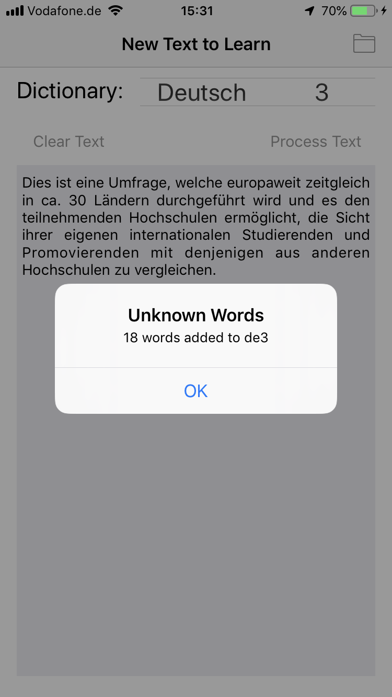
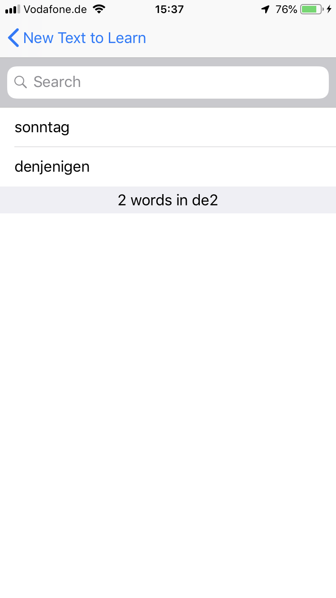

# Reading Vocabulary

This is a personal iOS App used to study German and English vocabuary before watch a movie or read a book.

The Application organizes the words by levels (of practicing), where each level corresponds with one number of Dictionary. There exist two Dictionaries (i.e. Deutsch and English) each one with five levels.

# Using

Having a desired text in the clipboard, it is possible paste it into the textarea in the App.

With the button "Process Text" the App will extract all the 'unknown' words and add these to the selected Dictionary. Understanding by 'unknow', all those words wich still   are not in any of the five Dictionary levels.

Using the folder icon at right corner, the App shows the list of words in the selected Dictionary.

There, with a left or rigth sliding it is possible move the word to the lower or higher Dictionary. Starting in five, the assumption here is that it contents the unknown or diffcult words, and the lower levels will have known or learned words. In this way, the Dictionary number one must have all the really known vocabulary.

Touching over any single word the App will show the meaning taken from the iOS dictionary(ies) available(s).

Holding the word, or pressing over it, the Delete option will appear.

And so on, the operation could be repeated typing the text, enrichment the Dictionary.

